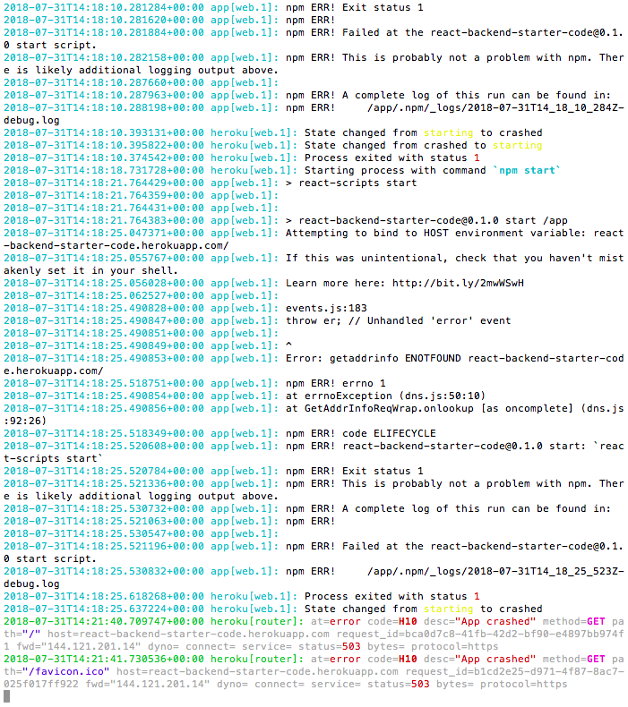

## WDI Instructor Code Challenge

### GOAL 

> Create a single page application that will utilize an external API to request movie data. The client side application will be served by a back-end which will have the ability to persist data.

#### Deliverables

- Please send us back a link to a git repo with the completed code challenge. 

- Include a README.md file in your repo with a link to your application deployed on Heroku.

- Note: Heroku [link broken](https://react-backend-starter-code.herokuapp.com/) possibly due to env api key variables (see logs below)

#### Bonus

- Link to the [node vanilla javascript movie finder](https://git.generalassemb.ly/layne/node-backend-movie-finder) repo

- Rewrite the application using a JavaScript MVC library (This app was written using React/Express/SQL database). Include a readme that explains the benefits and any additional challenges students would face learning the library.

#### Benefits

- Some of the benefits to using the React frontend library include:
  
  - It's a JavaScript framework
  - It uses a Component structure. Everything is broken down into components, allowing you to reuse them throughout the application.
  - it allows for fast view renders, updating without refreshing the entire page

- Some of the challenges I have noticed with students learning React is the ability/inability to wrap their heads around passing props and state dwon from parent to child components.
